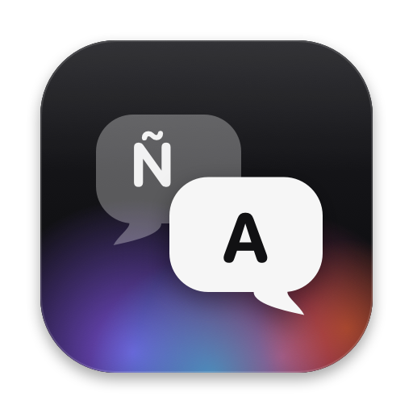
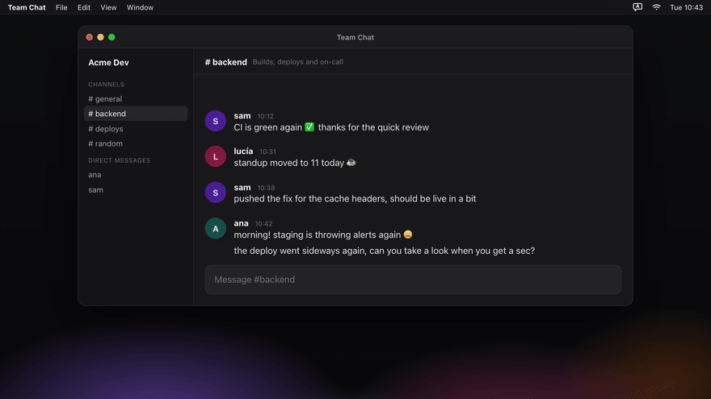

<p align="center">
  
</p>

<h1 align="center">VibeTranslator</h1>

<p align="center">
  Write in your language, send natural English (or any other language): one keyboard shortcut<br>
  translates your draft right in the message box, in Discord or any other app. It also turns rough requests into clear AI prompts.
</p>

<p align="center">
  <a href="https://github.com/albegosu/vibe-translator/actions/workflows/ci.yml"></a>
  <a href="LICENSE"></a>
  
  
</p>

<p align="center">
  
</p>

---

VibeTranslator is a native macOS menu bar app written in Swift. Press a shortcut while writing in Discord (or any other app) and your Spanish draft is replaced with a natural English translation. Mentions, links, emoji, code and formatting stay intact. The app never sends anything: you stay in control of the final message.

It can also translate any text you select (English → Spanish or Spanish → English) and turn a rough request into a clear prompt for an AI assistant or coding agent, both previewed in a floating panel.

> [!NOTE]
> The interface is available in English and Spanish and follows your system language.

## Features

- **Translate your draft**: one global shortcut translates the whole draft in place, ready to send. Built for Discord, it works in any app (Slack, Teams, Mail…), or only in the apps you choose.
- **Translate a selection**: select text anywhere (someone's message, a web page, a PDF) and get the translation in a floating panel next to the cursor, with **Copy** and, if the selection is editable, **Replace**. The language is detected automatically.
- **Improve a prompt** *(experimental)*: turn a rough request, in Spanish or English, into a clear prompt in English for an AI assistant or coding agent. Small requests stay one or two sentences; larger ones get only the sections that help. Code blocks, file paths, `@mentions`, URLs, `{{variables}}` and XML tags are kept intact. Preview it, then **Replace** or **Copy**.
- **Your languages**: pick the language you write in and the one to translate into, with regional variants (American or British English, Spain or neutral Latin American Spanish, Brazilian or European Portuguese…). Spanish → English by default.
- **Natural, not literal**: by default an LLM translates with a tone profile ("relaxed technical" out of the box), a glossary of terms to keep, and your own instructions. Idioms and slang are rendered by meaning.
- **Markup is preserved**: mentions (`<@id>`, `@user`, `@everyone`, `#channel`), emoji (Unicode, `:shortcode:`, `<:custom:id>`), links, inline code and code blocks, formatting (`**`, `||`, `~~`…), line prefixes (`>`, `-`, `#`, `-#`), line breaks and indentation.
- **Safe replacement**: the draft is only replaced if the same app, window or channel, field and text are still there. If anything changed while translating, nothing is touched.
- **Undo**: **Restore original** brings your Spanish text back, as long as you haven't edited the translation. **Copy original** works at any time.
- **Clipboard preserved**: whatever you had copied is restored afterwards, and temporary text is marked as transient so clipboard managers ignore it.
- **Pluggable engines with fallback**: Ollama, Apple Intelligence or Apple Translation. If the chosen engine is unavailable, fails or is too slow, Apple Translation takes over automatically.

## Requirements

- **macOS 26 or later** (uses `TranslationSession(installedSource:target:)`). Tested on macOS 27.
- **Xcode 26+ / Swift 6.2+** to build from source.
- **Accessibility permission**, needed to read the focused field and send ⌘A / ⌘C / ⌘V.
- **Language packs** for your two languages in Apple Translation, downloaded once from the app. It's also the fallback engine.
- Optional: **Apple Intelligence** enabled, or **[Ollama](https://ollama.com)** with a model.

## Installation

### Download

1. Get `VibeTranslator-*-macOS.zip` from the [latest release](https://github.com/albegosu/vibe-translator/releases/latest), unzip it and move **VibeTranslator.app** to `/Applications`.
2. Open it. The app isn't notarized yet, so macOS blocks it the first time: go to *System Settings › Privacy & Security*, scroll down and click **Open Anyway** next to VibeTranslator.
3. Continue with [First run](#first-run).

### Build from source

```bash
git clone https://github.com/albegosu/vibe-translator.git
cd vibe-translator
scripts/build-app.sh
open build/VibeTranslator.app
```

`scripts/build-app.sh` builds a release binary, assembles `build/VibeTranslator.app` and signs it ad hoc. Releases are built by CI when a `v*` tag is pushed (`.github/workflows/release.yml`).

### Keeping the Accessibility permission across rebuilds

macOS ties the Accessibility permission to the app's code signature. With an ad hoc signature, **every rebuild looks like a new app** and you have to remove and re-add VibeTranslator in *System Settings › Privacy & Security › Accessibility*.

To avoid that, create a code-signing certificate once: in *Keychain Access › Certificate Assistant › Create a Certificate…*, name it `VibeTranslator Dev` and choose type *Code Signing*. Then build with:

```bash
CODESIGN_IDENTITY="VibeTranslator Dev" scripts/build-app.sh
```

## First run

1. Open the app. A speech-bubble icon appears in the menu bar.
2. Grant the Accessibility permission when macOS asks (or from the menu).
3. Pick your languages in **Settings… › Translation › Languages** and download their packs for Apple Translation in **Apple Translation › Manage…** (the menu also warns you while they're missing).
4. Pick a translation engine in **Settings… › Translation**. See [Translation engines](#translation-engines).
5. In Discord or any other app, write a draft, keep the cursor in the message box and press `⌃⌥T`.

## Usage

| Shortcut (default) | Action |
| --- | --- |
| `⌃⌥T` | Translate the current draft in place, from your language to the target one |
| `⌃⌥Z` | Restore the original draft |
| `⌃⌥Y` | Translate the selected text in a floating panel: your language goes to the target, anything else to your language |
| `⌃⌥P` | Improve the selected prompt, or the whole field, and preview it before replacing (experimental) |

All shortcuts can be changed or removed in **Settings › General**, where you can also limit draft translation to a list of apps. Every action works in any app. Terminals (Claude Code and friends) never get their whole input translated, because pasting several lines into a shell runs them: select the text and use translate selection or improve prompt instead.

**Improve prompt** has two profiles in **Settings › Prompts**: *Coding agent task* (for larger tasks, Goal / Context / Requirements / Done when, only the sections that add information) and *Concise question*. It never adds requirements you didn't write and doesn't repeat itself; it only asks open questions when the agent couldn't proceed otherwise. It needs an LLM engine (Ollama or Apple Intelligence); with Apple Translation it only translates.

## Translation engines

| Engine | What it offers | Privacy |
| --- | --- | --- |
| **Apple Intelligence** (default) | On-device LLM; follows the tone, glossary and your instructions | Everything stays on your Mac |
| **Ollama** | Any model you choose, with the same style profile. `gemma4:12b` works well locally; `gemma4:31b-cloud` if you'd rather not load your Mac | Local, except `…cloud` models, which the app labels as cloud |
| **Apple Translation** | Classic machine translation: fast and reliable, but no tone control | Everything stays on your Mac |

LLM engines receive the whole draft in a single request (`{"lines": [...]}`), so every line has the context of the others. Responses are validated:

- one line per input line;
- no empty lines;
- no disproportionately long lines, which usually mean the model answered the message instead of translating it.

If a check fails, or the engine takes longer than 20 s, the draft is translated with Apple Translation and the notification says so.

The engine and the style profile (tone, glossary, extra instructions) live in **Settings › Translation** and apply on the next translation, without restarting.

## How it works

### Reading and replacing the draft

| Method | Read | Write |
| --- | --- | --- |
| Accessibility | `AXValue` of the focused element | Select all, replace `AXSelectedText` (or `AXValue`) and read back to verify |
| Clipboard | ⌘A ⌘C, then restore the clipboard | ⌘A ⌘C (check nothing changed), ⌘V, then restore the clipboard |

**Automatic** (the default) uses the clipboard in Electron apps such as Discord and Accessibility in native text fields, falling back to the clipboard. Discord's editor (Slate) keeps its own document model, so:

- writing through Accessibility can change what you see without changing what gets sent;
- the editor's own copy and paste handlers keep mentions and custom emoji in their canonical form (`<@id>`, `<:name:id>`).

⌘A / ⌘C / ⌘V are resolved against the active keyboard layout, so they also work with AZERTY, Dvorak and others.

### Protecting markup

`DraftTranslator` (in `VibeTranslatorCore`) works line by line:

1. Fenced code blocks are left untouched.
2. Indentation and line prefixes are kept aside.
3. Every protected span becomes a `{n}` placeholder and the whole line is translated, so the engine keeps the sentence context.
4. Each placeholder must come back **exactly once**. If the engine dropped or duplicated one, that line is translated fragment by fragment instead, so markup is never lost.
5. The first letter of each line is matched to the original's case, whatever the engine returned.

### Improving a prompt

`PromptImprover` rewrites the whole text in one request instead of line by line:

1. Code blocks, file paths, `@mentions`, URLs, template variables and XML tags become `⟦n⟧` tokens.
2. Every token must come back. A path may be mentioned twice, but a code block must appear exactly once and is always put back on lines of its own.
3. A rewrite that starts answering the request (new code) is rejected; if every LLM fails, the prompt is at least translated with Apple Translation.

## Privacy

- VibeTranslator has no server, no analytics and no telemetry.
- Your settings live in macOS preferences; diagnostic reports are saved locally in `~/Library/Logs/VibeTranslator/`.
- Text only leaves your Mac if you choose an Ollama cloud model. In that case it goes to Ollama through the Ollama app on your Mac.
- Your clipboard is saved and restored around every automated copy and paste.

## Technical validation

The menu's **Technical Validation** entry runs diagnostics on the focused field (the report is always in English, ready to paste into an issue):

- **Diagnose focused field**: after 3 s, reports the macOS and app versions, whether the app is Electron, the result of `AXManualAccessibility`, the element's role, attributes and writable properties, and compares `AXValue` with what ⌘A ⌘C returns.
- **Diagnose and test writing** (with an **empty** draft): also checks whether writing through Accessibility reaches the editor's model (not only the DOM) and whether a multi-line paste arrives intact. The field is cleared afterwards; nothing is ever sent.

The report opens in a window and is saved to `~/Library/Logs/VibeTranslator/`.

## Project structure

```
Sources/VibeTranslatorCore/       Pure, tested logic
  DraftMarkup.swift               Discord markup recognition
  DraftTranslator.swift           Line-by-line pipeline, placeholders, engine fallback chain
  PromptImprover.swift            "Improve prompt": token masking, instructions, validation
  TranslationStyle.swift          Tone profile and LLM prompt / response format
  LanguageDirection.swift         Language detection for "translate selection"
  AppScope.swift                  Apps where draft translation may act; terminals excluded
Sources/VibeTranslator/           Menu bar app
  AppModel.swift                  Orchestrates translate / restore / selection / prompts / diagnostics
  Draft/                          Safe reading and replacing (Accessibility and clipboard)
  Translation/                    Ollama, Apple Intelligence and Apple Translation engines
  System/                         Accessibility, global shortcuts (Carbon), keyboard, clipboard
  Settings/ UI/ Diagnostics/      Settings, HUD, floating panel, validation report
Tests/VibeTranslatorCoreTests/    Unit tests (Swift Testing)
scripts/                          App bundle, icon, release notes and helper scripts
scripts/demo/                     Renders the README demo (Playwright + ffmpeg)
```

## Known limitations

- Apple Translation doesn't cover every language or variant (Catalan, for example); LLM engines do. Without the pair in Apple Translation there's no fallback if the LLM fails.
- Improve prompt is experimental: the result depends on the model, so always read the preview before replacing.
- Tone only applies to LLM engines; Apple Translation doesn't take instructions.
- Replacing a selection has no "Restore original"; use ⌘Z in the app itself.
- Markdown links (`[text](url)`) are kept whole, without translating the text.
- Drafts longer than 4,000 characters aren't translated whole (in a code editor ⌘A selects the entire file): select the part you want and use translate selection.
- A translation longer than Discord's character limit may make Discord offer to send it as a file.

## Contributing

Contributions are welcome! Please read [CONTRIBUTING.md](CONTRIBUTING.md) and follow the [Code of Conduct](CODE_OF_CONDUCT.md). To report a security issue, see [SECURITY.md](SECURITY.md).

## License

[MIT](LICENSE) © 2026 albegosu
